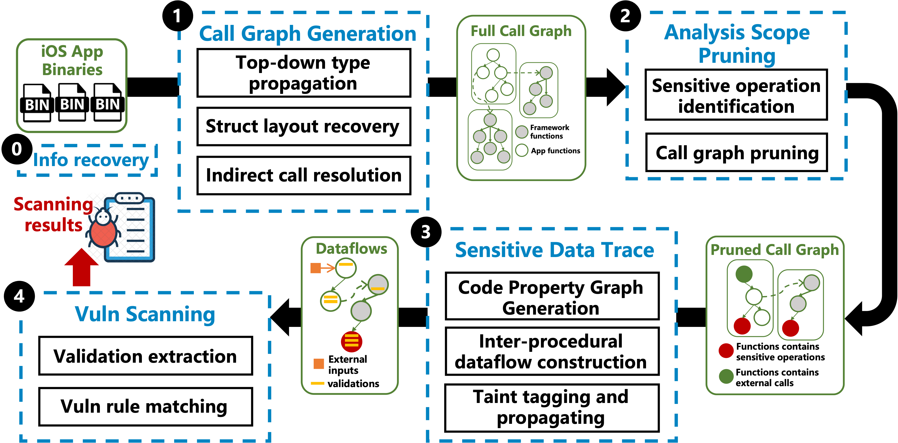
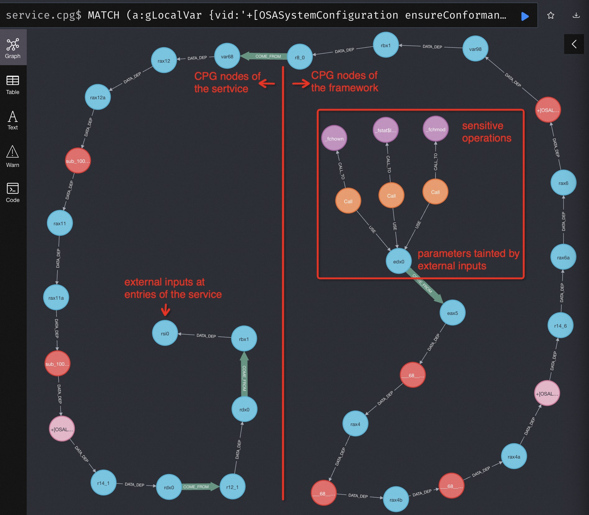

# AegiScan

**Aegi(s)Scan(er)** is a static dataflow analysis framework for iOS application binaries, which can be used to facilitate vulnerability scanning.

## Overview

### Design

AegiScan utilizes top-down type propagation to resolve Objective-C MsgSend calls, thereby reconstructing the call graph. 
It then generates the Code Property Graph (CPG) for each function to establish context-sensitive dataflow. 
Leveraging the call graph, AegiScan integrates the CPGs of different functions for comprehensive inter-procedural analysis. 
Moreover, AegiScan recovers information lost during optimization (e.g., app thinning) and incorporates it into the analysis.

<div align="center">

</div>

### Implementation

AegiScan is featured with a combination of binary analysis and graph database.
The binary analysis, built on the IR of IDA Pro (aka. Microcode), only needs to be conducted once, with the results stored in the Neo4j graph database for multiple queries.
In addition, to facilitate vulnerability scanning,
AegiScan provides query APIs based on Neo4j's Cypher query language and interfaces for developing custom scanners.

## Usage

### AegiScan Setups

The requirements of AegiScan:
1. IDA Pro 7.4+ with Hexray, therefore Microcode IR is valid.
   * Version 8.3+ is recommended for optimization in the IDB-830 format.
2. Docker to deploy databases, as specified in `db/docker-compose.yml`

If you want to develop based on AegiScan, I recommend the following IDA plugins to facilitate:
1. [`genmc`](https://github.com/patois/genmc) to display Hex-Rays Microcode of the binary.
2. [`IDACode`](https://github.com/ioncodes/idacode) to debug idapython via VSCode.
3. [`IPyIDA`](https://github.com/eset/ipyida) to use ipython in IDA Pro.

To set up the AegiScan:
1. `cd AegiScan/db` and run `docker-compose up -d` to launch the Neo4j database.
2. `cd AegiScan/src` and execute `ida_runner.py` to start your task. For example, execute command `ida64 -A -S"{Path to ida_runner.py} {parameters}" -L"Path to your log file}" "{Path to your idb}"`

### Starting with an Example

#### Target Binaries for Analysis

Under the `AegiScan/cases` folder, we provide two binaries: 
* One from a native macOS system service at `AegiScan/cases/os/System/Library/CoreServices/osanalyticshelper`
* The other from a private framework at `AegiScan/cases/os/System/Library/PrivateFrameworks/OSAnalytics.framework/Versions/A/OSAnalytics`

Before moving forward with the following steps, you need to generate the corresponding IDB files for the two binaries and place them in the appropriate directories. 
For example, execute the command `ida64 -A -B /path/to/service` to produce the `osanalyticshelper.i64` file, then place it in the `case/services` directory.

#### Commands to conduct analysis

Execute the following commands to perform dataflow analysis:
* `cd AegiScan/src`
* `ida64 -A -S"/Path/to/ida_runner.py service /Path/to/cases" -L"/Path/to/cases/out/service.log" '/Path/to/cases/services/osanalyticshelper.i64'`

Specifically, `ida_runner.py` employs `ServiceChecker` definded in `AegiScan/src/scanners` to analyze binaries through five steps:
1. generate a call graph starting from (ns)xpc entry points of the service called osanalyticshelper.
2. Identify external calls to the private framework called OSAnalytics.
3. Create CPGs and commit them to the database.
4. Spawn an IDA process to generate call graphs and CPGs for the framework, starting from the external calls identified in step 2.
5. Analyze how external inputs impact sensitive operations and extract input validations for auditing.

#### Analysis Results

The analysis generates two types of results:
* Inter-procedural code property graphs and dataflows, stored in the graph database.
* Sensitive operations influenced by external inputs and their corresponding input validations, identified by `ServiceChecker`.

The **code property graphs** stored in the database can be quries further. For example:
* Visit url at http://localhost:7474 (credentials: neo4j, AegiScan)
* Enter the Cypher query `MATCH (a:gLocalVar {vid:'+[OSASystemConfiguration ensureConformanceOfFile:]$2'}), (b:gLocalVar {vid:'sub_10000281F$1'}), path = shortestpath((a)-[:DATA_DEP|COME_FROM*]->(b)) RETURN path ORDER BY LENGTH(path) DESC LIMIT 1` to retrieve the dataflow from external inputs to sensitive operations
* The resulting dataflow is illustrated below:

<div align="center">

</div>

The results of the dataflow analysis, capturing both sensitive operations affected by external inputs and their associated input validations, are recorded within the `cases/out/` directory. For example, `service.log` records following contents:

```
Tainted trace detected: sub_10000281F$1->-[NSFileManager moveItemAtPath:toPath:error:]$1
	_xpc_dictionary_get_string, without const args
	_os_log_type_enabled, without const args
	-[UNKNOWN length], without const args
	-[NSDictionary objectForKeyedSubscript:], const args: ['override-filePath']
	-[NSMutableDictionary osa_logCounter_isLog:byKey:count:withinLimit:withOptions:], without const args
	-[OSASystemConfiguration logPathForType:at:options:], without const args
Tainted trace detected: sub_10000281F$1->_fchown$0
	_xpc_dictionary_get_value, const args: ['options']
	-[UNKNOWN length], without const args
	-[NSDictionary objectForKeyedSubscript:], const args: ['override-filePath']
	-[OSASystemConfiguration logPathForType:at:options:], without const args
	-[NSMutableDictionary osa_logCounter_isLog:byKey:count:withinLimit:withOptions:], without const args
	_fopen, const args: ['r']
Tainted trace detected: sub_10000281F$1->_fchmod$0
	_xpc_dictionary_get_value, const args: ['options']
	-[UNKNOWN length], without const args
	-[NSDictionary objectForKeyedSubscript:], const args: ['override-filePath']
	-[OSASystemConfiguration logPathForType:at:options:], without const args
	-[NSMutableDictionary osa_logCounter_isLog:byKey:count:withinLimit:withOptions:], without const args
	_fopen, const args: ['r']
    ...
```

The extracted validations reveal that the service only verifies that the specific fields of XPC requests are not null. 
Additionally, it fails to authenticate XPC clients. 
Consequently, malicious entities could exploit the `moveItemAtPath`, `fchmod`, and `fchown` by manipulating the `override-filePath` field, leading to CVE-2021-30774.

### Develop customized vulnerability scanners

AegiScan is a framework for static dataflow analysis that supports the creation of tailored vulnerability scanners. The development process involves three primary steps:
* Step 1: Define your entry points and sensitive operations, and incorporate your IDAPython scripts into `src/entries` and `src/sinks` to identify custom entries and operations within the IDB.
* Step 2: Develop your custom scanners, derived from `BaseScan` under `src/scanners`, which include the foundational workflow for generating call graphs and code property graphs that you can adapt to your needs.
* Step 3: Modify `src/ida_runner.py` to deploy your custom scanners across various scenarios in iOS apps and other Objective-C binaries.

Furthermore, AegiScan is scalable and capable of supporting additional features in both binary analysis and graph querying. To implement your custom analysis, you may:
*  Revise `src/intra_procedural.py` and the visitors within `src/visitors` to refine the analysis of individual binary functions.
*  Adapt `src/inter_procedural.py` to customize inter-procedural tasks.
*  Extend `src/record.py` and graph models under `src/models` to tailor code property graph definitions and construct dataflows according to your specifications.
*  Amend `src/libs/queries.py` to include custom queries and strategies tailored to your analysis goals.

## References

This work is derived from our prior work iService[1].

[1] Wang, Yizhuo, et al. "iservice: Detecting and evaluating the impact of confused deputy problem in appleos." Proceedings of the 38th Annual Computer Security Applications Conference. 2022.